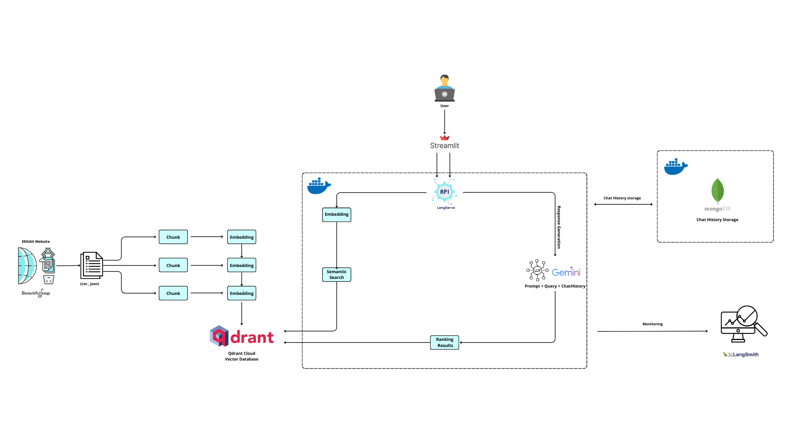
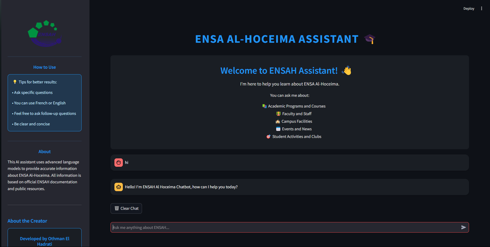
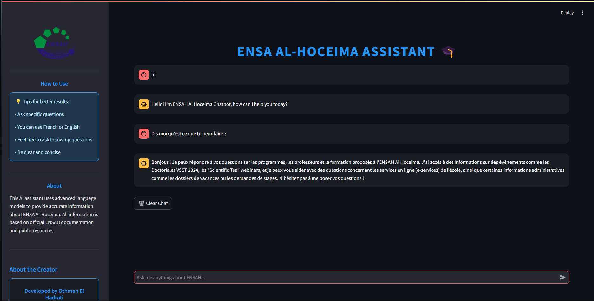
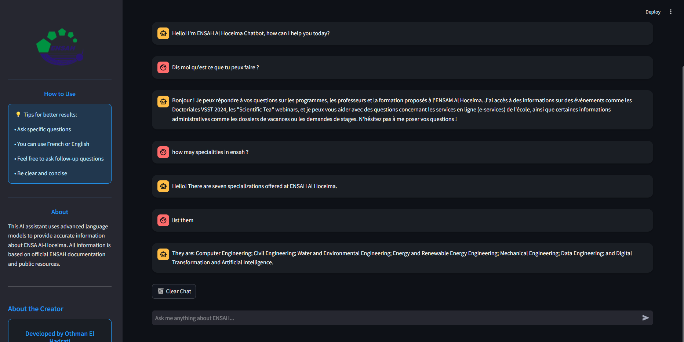

# ENSAH Assistant (ENSAH-RAG)

A conversational AI assistant powered by RAG (Retrieval-Augmented Generation) technology to provide information about ENSA Al-Hoceima (École Nationale des Sciences Appliquées d'Al-Hoceima).

## 🏗️ Architecture



## 🌟 Features

- Interactive chat interface built with Streamlit
- RAG-based responses using LangChain and Google Generative AI
- Vector storage with Qdrant for efficient information retrieval
- Comprehensive web scraping system for ENSAH website data
- Multi-language support 
- Real-time information about:
  - Academic programs and departments
  - News and announcements
  - Scientific activities
  - Faculty members
  - Administrative information
  - General information about ENSAH
- Persistent chat history using MongoDB
  - Maintains conversation context across sessions
  - Stores user interactions and responses
  - Enables personalized experiences
- Session Management
  - Unique session IDs for each user
  - Local storage integration for session persistence
  - Stateful conversations across page refreshes

## 🛠️ Technology Stack

- **Frontend**: Streamlit
- **Backend**: FastAPI , LangServe
- **Vector Database**: QdrantDB (Cloud storage)
- **LLM Integration**: LangChain, Google Generative AI
- **Web Scraping**: BeautifulSoup4
- **Data Storage**: MongoDB (for chat history)
- **Monitoring**: LangSmith
- **Containerization**: Docker

## 📁 Project Structure

```
ENSAH-RAG/
├── DataENG/          # English language data
├── DataFR/           # French language data (original data)
├── Image/            # Core RAG and API handlers
├── QdrantDB/         # Vector database storing scripts
├── RawData/          # Raw scraped data
├── Scrapers/         # Web scraping modules
├── assets/          # Static assets
├── app.py           # Streamlit frontend
├── docker-compose.yml
├── requirements.txt
└── README.md

## 🚀 Getting Started

### Prerequisites

- Python 3.8+
- Docker and Docker Compose
- Google AI API key
- QdrantDB API key
- LangSmith API key

### Installation

1. Clone the repository:
```bash
git clone https://github.com/ELhadratiOth/ENSAH-ChatBot-RAG-APP
cd ENSAH-RAG
```

2. Create and activate a virtual environment:
```bash
python -m venv venv
source venv/bin/activate  # On Windows: venv\Scripts\activate
```

3. Install dependencies:
```bash
pip install -r requirements.txt
```

4. Set up environment variables:
rename a `sample.env` file to `.env` and fill it with:
```
GOOGLE_API_KEY=GOOGLE_API_KEY
QDRANT_API_KEY=QDRANT_API_KEY
QDRANT_URL=QDRANT_URL
LANGSMITH_API_KEY=LANGSMITH_API_KEY
```

5. Start the services using Docker Compose:
```bash
docker-compose up -d
```

6. Run the application:
```bash
streamlit run app.py
```

## 🔧 Components

### Web Scrapers
Located in the `Scrapers/` directory, includes modules for scraping:
- News and announcements
- Faculty information
- Academic programs
- Administrative information
- Scientific activities
- General information

### RAG System
The `Image/` directory contains the core RAG implementation:
- Vector store management
- Chat history handling
- API endpoints
- Prompt templates
- Response generation

### Frontend
The Streamlit interface (`app.py`) provides:
- Chat interface
- Source attribution
- Session management
- Responsive design

## 📸 User Interface

Here are some screenshots of the ENSAH Assistant interface:





### Chat History and Session Management
The system implements sophisticated chat history and session handling:

#### MongoDB Chat History
- Persistent storage of chat messages in MongoDB
- Each conversation is linked to a unique session ID
- Enables context-aware responses by maintaining conversation history
- Custom `LastNMessageHistory` implementation for efficient history management

#### Session Management System
- Generates unique session IDs for each user
- Integrates with local storage for session persistence
- Maintains user context across page refreshes
- Seamless conversation continuity between visits

This robust history and session management enables:
- Context-aware conversations
- Personalized user experiences
- Consistent chat flow across sessions
- Improved response relevancy through historical context

## 🤝 Contributing

Contributions are welcome! Please feel free to submit a Pull Request.
